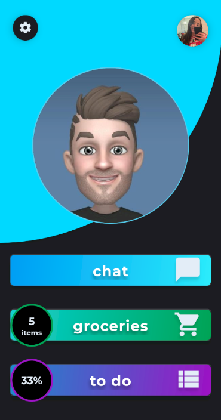
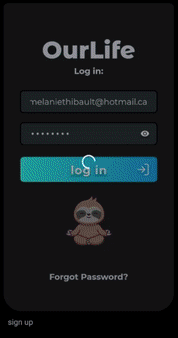
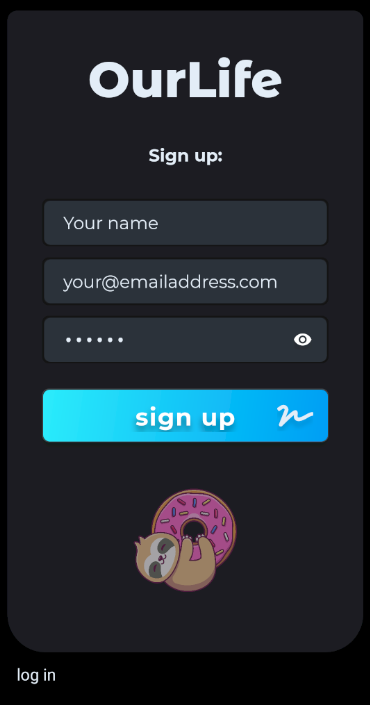
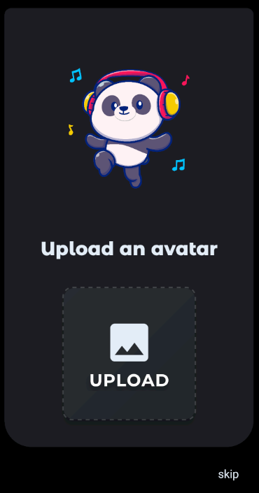
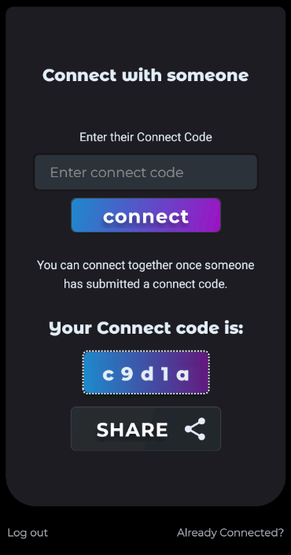
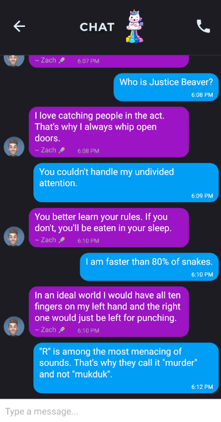
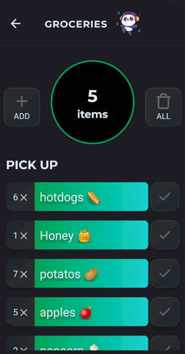
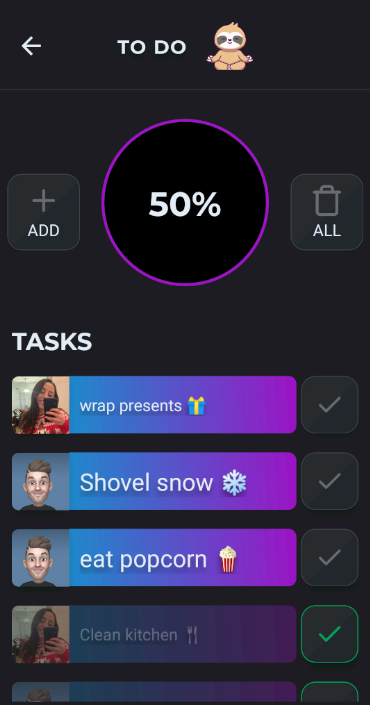
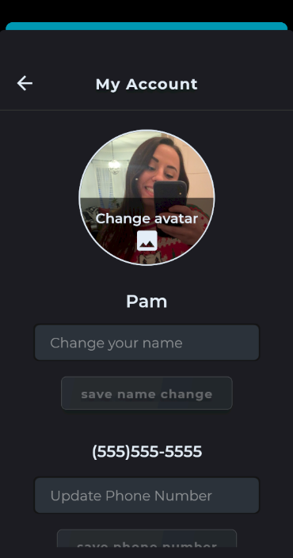
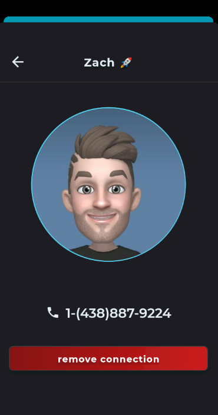

# Our Life

A mobile application created with React Native.

## Description

> Our Life allows users to connect with a single other user. It was built as a final project for a Full-Stack Web Development Bootcamp. The purpose of the app is to help people organize their lives. More specifically, to help communicate what needs to get done.

## Features

- Connect with one other person.
- Private chat
- Shared grocery list
- Shared to do list
- Real-time changes

## Technologies

- [React](https://github.com/facebook/react)
- [React Native](https://github.com/facebook/react-native)
- [Typescript](https://github.com/microsoft/TypeScript)
- [Expo](https://github.com/expo/expo)
- [React Navigation](https://github.com/react-navigation/react-navigation)
- [Gifted Chat](https://github.com/FaridSafi/react-native-gifted-chat)
- [Redux](https://github.com/reduxjs/redux)
- [Firebase](https://firebase.google.com/)

## How can I use it?

- For android, download the [Expo](https://play.google.com/store/apps/details?id=host.exp.exponent&hl=en_CA&gl=US) app.
- For iOS, download the [Expo Client](https://apps.apple.com/ca/app/expo-client/id982107779) app.
- Use the app ( android ) or camera ( iOS ) to scan the QR code below:

- Create an account 
  
- Upload an Avatar  
  
- Connect with one other person. One of the two users needs to enter it on the screen that requests the Connect Code.  
  
- Admire the other person's avatar at the center of your Dashboard.  
  
- Start chatting on the Chat screen  
  
- You can add, edit, and delete grocery items on the Groceries screen.  
  
- You can add, assign, edit, and delete tasks on the Todo screen.
  
- Once a grocey or task is marked as completed, it will go to the bottom of the list.
- Once a completed task or grocery item is marked as uncompleted, it will go to the top of the list.
- You can modify your name, avatar, and phone number.  
  
- If the other person annoys you too much, you can always remove the connection and find someone else to connect with. 🤭  
  
